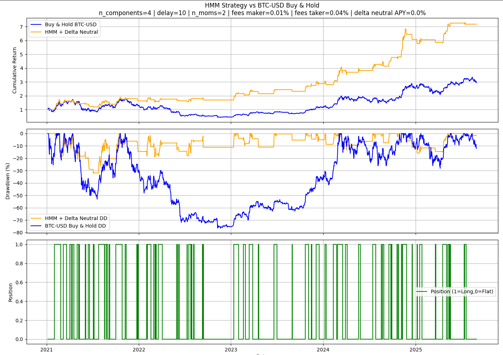
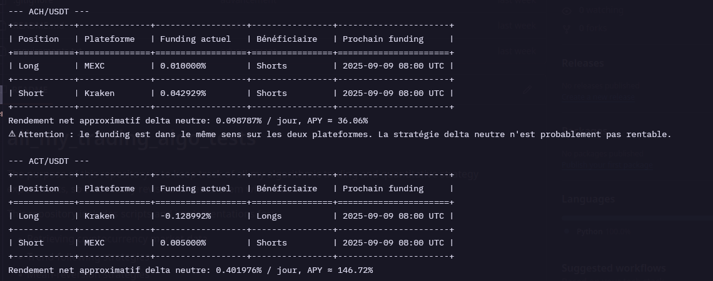
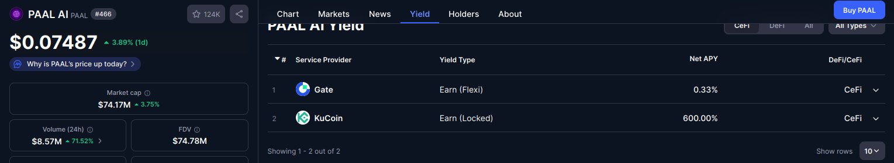
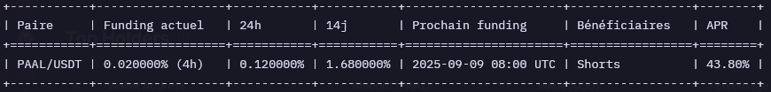

# all_my_trading_algo_tests

The purpose of this repository is to keep track of all my algorithmic trading and quantitative strategy experiments, so I can easily revisit and reuse them when needed.

This repository includes scripts and implementations for:

- Retrieving cryptocurrency market data
- Trend-following strategies
- Mean-reversion strategies
- Hedging strategies
- Staking strategies

---

Voici une première version d’un **README en anglais** décrivant les stratégies que tu as listées, avec le calcul demandé sur la stratégie delta neutral + staking.

---

## Trading Strategies

### 1. Hidden Markov Model (HMM)

The Hidden Markov Model can be applied to financial time series in order to detect hidden market regimes (e.g., bull, bear, or sideways).
By training an HMM on historical price data, we can attempt to forecast short-term market states and adjust exposure accordingly.

---

### 2. Delta-Neutral Cross-Exchange Arbitrage

In a delta-neutral setup, we take offsetting positions on two different exchanges.
For example:

* **Long position** on MEXC
* **Short position** on Kraken

The objective is to capture price inefficiencies between exchanges while maintaining a market-neutral stance.
This reduces exposure to general price movements while profiting from spreads, funding rate differentials, or liquidity imbalances.

---

### 3. Delta-Neutral + Staking (Hedged Yield Farming)

This strategy combines short-selling with staking to achieve a double-yield, hedged position.

**Example:**

* Asset: **\$PAAL**
* **Spot position**: Buy and stake \$PAAL on Kucoin with a **600% APY** (14-day lock period).
* **Hedging position**: Short \$PAAL with an APY of **43.8%** (borrow/lend/funding yield).

This setup results in:

* Exposure neutralized (long in spot, short in derivatives).
* Double yield: staking reward + shorting yield.

#### Calculation (14-day period)

* Staking APY: **600% annualized**

  * 14-day effective return = $600\% \times \frac{14}{365}$
  * ≈ **23.01% in 14 days**

* Shorting APY: **43.8% annualized**

  * 14-day effective return = $43.8\% \times \frac{14}{365}$
  * ≈ **1.68% in 14 days**

* **Total yield (delta-neutral, 14 days):**
  $23.01\% + 1.68\% ≈ 24.69\%$

This means that by rebalancing every 14 days, the position theoretically yields **\~24.7% every cycle**.
Annualized, if sustained and compounded, this could exceed **600%+** while remaining hedged against price volatility.

Since the staking lock period is 14 days, the strategy requires re-arbitrage every cycle:

* Close short and staking positions at the end of the 14-day lock.
* Re-enter both legs with updated market conditions and APY rates.
* Monitor funding rates and staking APY closely to ensure profitability.
